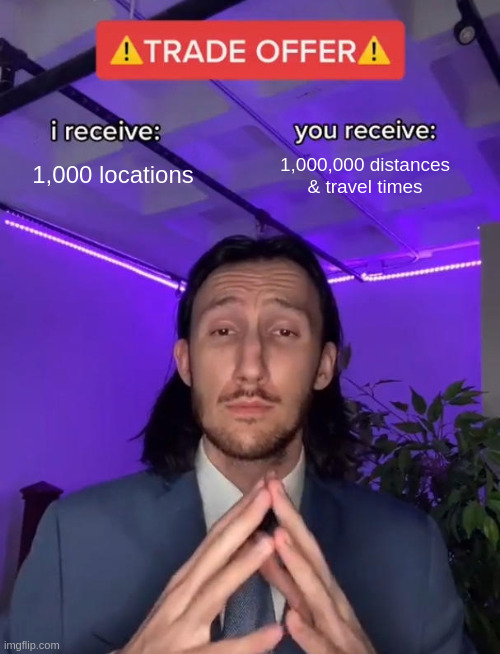

> This post is based on my talk at the Waterkant Festival 2026.

The AI hype is as ubiquitous as it is annoying.
Some say that AI will beat software engineers at every task in a few months.
Some say that human programmers will always be better than AI.

Obviously, both extremes are wildly wrong.
But what does help to say "the truth is more complicated" without actually figuring out what this complicated bit is?

---

As most software engineers, I care about solving real problems in the real world.
Unsolved problems.
Hard problems.
The stuff that tickles your mind, and that requires some novel solutions and the right trade-offs.
And I think it's fun to do excellent work and build something _outstanding_.

Can LLMs even help me at all?

I have tried to use LLMs numerous times throughout the years.
Every time I found that they produce slop and waste my time.
They either forced me to accept bad changes, or they made me fix up their changes manually which was slower than just doing everything by hand.

In early 2026, this changed.
Time to collect some evidence.

Instead of just using the latest hype tool, I wanted to understand this properly.
Let's take a more structured approach then:

1. Take a properly hard engineering problem.
2. Get your CTO to pay for infinite tokens.
3. Systematically try out various ways to use LLMs, and write down how it goes.

This is what I did in March 2026, and here is what I found out.

## A Hard Problem

At [my current employer](https://solvares-fieldservice.com/), we solve large instances of the Vehicle Routing Problem ([wiki](https://en.wikipedia.org/wiki/Vehicle_routing_problem)).
One reasonably hard problem from this domain is that we have to compute a distance matrix as input to our smart algorithms.
What's more: Our logic to compute a distance matrix had long been troubled by heaps of legacy code and stability issues, so it posed a good candidate to replace it by something better.

Now, what is a distance matrix, you may ask?

Let me explain.



Essentially, we want to have a web server with a single endpoint.
As **input** (request body), it accepts an array of locations as lat/lon coordinates.

```json
{
  "coordinates": [
    { "lat": 54.0, "lon": 10.0 },
    { "lat": 54.1, "lon": 10.1 },
    { "lat": 54.2, "lon": 10.4 }
  ]
}
```

The server then looks at the world's road network and computes the best routes from each point to each other point, and returns only the distances and travel times as a large matrix.
We do not return any information about the routes themselves, except for the length and duration.

Conceptually, the **output** (response body) looks like this:

```json
{
  "distances": [
    [0, 18201, 55879],
    [18204, 0, 32444],
    [61390, 38199, 0]
  ],
  "times": [
    [0, 1319, 3121],
    [1343, 0, 2279],
    [3414, 2670, 0]
  ]
}
```

Note that from each point to itself, the distance is zero meters (and the time is zero seconds).
Due to one-way streets, turn restrictions, etc, going from A to B is only _approximately_ as far as from B to A.

What makes this problem so hard is the extreme performance that we require.
For example, **for 1000 locations we have no more than 100 milliseconds**.

That's right: _one million routes_ must be computed and measured, and the results must be encoded and transmitted over the network and parsed by the client, and all of this must happen in _less than a tenth of a second_.
Even if we ignore all the networking, we only have 100 nanoseconds to compute each route.

That seems impossible.
I guess we can agree that this problem is reasonably hard.
Vibe-coding this cannot work.

## An Impressive Solution

I don't want to go into the details of the sophisticated algorithms and insane optimisations that were needed to pull this off.
After all, this post is about how LLMs helped me, not about how the system looks.
But here is the data on what it took to build this service:

- 3 weeks of regular full-time work
- by a single person (me)
- with around €1200 in tokens

Around half of the time (and the tokens) was spent on the actual design and the rust implementation.
The other half was spent on building the surrounding testing and benchmarking tooling in order to evaluate the solution, as well as to integrate it into our existing infrastructure.

Here is the p90 performance data for our `c5a.4xlarge` instance on AWS (8 physical AMD Zen 2 cores):

| N locations | N*N matrix cells | time to last byte |
| ----------- | ---------------- | ----------------- |
| 3           | 9                | 0.8 ms            |
| 500         | 250,000          | 31 ms             |
| 1,000       | 1,000,000        | 75 ms             |
| 5,000       | 25,000,000       | 602 ms            |
| 10,000      | 100,000,000      | 4837 ms           |

That's pretty solid!
Computing 100M distances and travel times in under five seconds on a regular 8-core machine can be counted as a success.

Almost everything is LLM-generated.
Out of approximately 15,000 lines of code in total, I think I wrote 4 manually and the other 14996 or so with an LLM.

Along the way, I wrote a detailed log of what I tried, what worked, and what didn't.
I noted down _how_ I tried to work with LLMs, rather that saying anything about which algorithms I tried.

This diary now lets us answer the key question of this entire blog post:

## When do LLMs actually help, and when should you avoid them?

The answer is … that it's the wrong question.
At least, there is a better question to ask:

## What Is an LLM?

I found that it's more helpful to build an understanding of what an LLM is.
If you have a good intuition for what an LLM is, it is rather obvious how to characterize the kind of tasks where LLMs can help you.

I mean this in an intuitive sense, not in a technical one.
Some people say that LLMs are **next-token prediction machines**.
That's perfectly accurate but not what I mean.
This intuition is not very enlightening in day-to-day work.

In other words, “here is a machine to predict the next word for you” does not tell me anything about how I should embed it into my workflow.

Instead, I believe we should understand LLMs as **semantic translation machines**.
They translate an idea or a concept from one representation to another.

The term _semantic translation_ needs some clarification.

## Semantic Translation

By semantic translation, I mean that a concept or an idea is translated semantically from one representation to another.

<div>
<svg id="semantic-translation-diagram" class="semantic-diagram" fill="none" stroke="none" stroke-linecap="square" stroke-miterlimit="10" xmlns="http://www.w3.org/2000/svg" viewBox="125 170 745 490" width="745"
  height="490" style="display: block; width: 100%; max-width: 100%; height: auto; margin: 10px auto;" role="img" aria-labelledby="semantic-translation-title"
  aria-describedby="semantic-translation-desc">
  <title id="semantic-translation-title">Semantic translation</title>
  <desc id="semantic-translation-desc">Three connected nodes form a triangle:
    English at the bottom left, English summary at the top, and source code at
    the bottom right. Solid lines connect all three nodes, and dashed lines
    extend outward from each node.</desc>
  <!-- Definitions -->
  <defs>
    <style>
    .semantic-diagram {
      --diagram-line: #315da8;
      --diagram-dashed: #776b5a;
      --diagram-accent: #b42338;
    }
    [data-color-mode="dark"] .semantic-diagram {
      --diagram-line: #8aadf4;
      --diagram-dashed: #7b8092;
      --diagram-accent: #f0808e;
    }
    .semantic-diagram .text {
      font-family: Arial, sans-serif;
      font-size: 19.5px;
      font-weight: bold;
      fill: var(--color-text);
    }
    .semantic-diagram .solid-line {
      stroke: var(--diagram-line);
      stroke-width: 2.5;
    }
    .semantic-diagram .dashed-line {
      stroke: var(--diagram-dashed);
      stroke-width: 2.5;
      stroke-dasharray: 8 6;
    }
    .semantic-diagram .dot {
      fill: var(--diagram-line);
    }
    </style>
  </defs>
  <g>
    <path fill="var(--diagram-line)" d="m292.8 513.4488c0 -5.2184143 4.2304077 -9.4487915 9.448822 -9.4487915c2.5059814 0 4.9093323 0.9954834 6.6813354 2.7674866c1.7720032 1.7720032 2.7674866 4.175354 2.7674866 6.681305c0 5.218445 -4.230377 9.448853 -9.448822 9.448853c-5.2184143 0 -9.448822 -4.2304077 -9.448822 -9.448853z" fill-rule="evenodd" />
    <path fill="var(--diagram-line)" d="m478.72 291.6888c0 -5.218445 4.230377 -9.448822 9.448822 -9.448822c2.5059814 0 4.9093323 0.9955139 6.681305 2.767517c1.7720032 1.7719727 2.767517 4.1753235 2.767517 6.681305c0 5.218445 -4.230377 9.448822 -9.448822 9.448822c-5.218445 0 -9.448822 -4.230377 -9.448822 -9.448822z" fill-rule="evenodd" />
    <path fill="var(--diagram-line)" d="m690.56 465.14645c0 -5.218445 4.2304077 -9.448822 9.4487915 -9.448822c2.5060425 0 4.909363 0.9955139 6.6813354 2.7674866c1.7720337 1.7720032 2.767517 4.175354 2.767517 6.6813354c0 5.218445 -4.2304077 9.448822 -9.448853 9.448822c-5.218384 0 -9.4487915 -4.230377 -9.4487915 -9.448822z" fill-rule="evenodd" />
    <text x="282" y="537" text-anchor="end" fill="var(--color-text)" font-family="Arial, sans-serif" font-size="24" font-weight="bold">English</text>
    <text x="474" y="248" text-anchor="end" fill="var(--color-text)" font-family="Arial, sans-serif" font-size="24" font-weight="bold">English</text>
    <text x="474" y="276" text-anchor="end" fill="var(--color-text)" font-family="Arial, sans-serif" font-size="24" font-weight="bold">summary</text>
    <text x="720" y="461" fill="var(--color-text)" font-family="Arial, sans-serif" font-size="24" font-weight="bold">source</text>
    <text x="720" y="489" fill="var(--color-text)" font-family="Arial, sans-serif" font-size="24" font-weight="bold">code</text>
    <path stroke="var(--diagram-line)" stroke-width="3.0" stroke-miterlimit="8.0" stroke-linecap="butt" d="m326.8647 510.0l345.1353 -41.24997" fill-rule="evenodd" />
    <path stroke="var(--diagram-line)" stroke-width="3.0" stroke-miterlimit="8.0" stroke-linecap="butt" d="m317.66666 498.33334l156.0 -192.0" fill-rule="evenodd" />
    <path stroke="var(--diagram-line)" stroke-width="3.0" stroke-miterlimit="8.0" stroke-linecap="butt" d="m681.198 449.66666l-175.198 -145.66666" fill-rule="evenodd" />
    <path stroke="var(--diagram-dashed)" stroke-width="3.0" stroke-miterlimit="8.0" stroke-linecap="butt" stroke-dasharray="12.0,9.0" d="m285.33334 501.0l-76.28978 -59.399994" fill-rule="evenodd" />
    <path stroke="var(--diagram-dashed)" stroke-width="3.0" stroke-miterlimit="8.0" stroke-linecap="butt" stroke-dasharray="12.0,9.0" d="m311.69763 627.6881l-7.697632 -96.68811" fill-rule="evenodd" />
    <path stroke="var(--diagram-dashed)" stroke-width="3.0" stroke-miterlimit="8.0" stroke-linecap="butt" stroke-dasharray="12.0,9.0" d="m710.04987 579.34406l-7.697632 -96.68811" fill-rule="evenodd" />
    <path stroke="var(--diagram-dashed)" stroke-width="3.0" stroke-miterlimit="8.0" stroke-linecap="butt" stroke-dasharray="12.0,9.0" d="M496 270 L518 210" fill-rule="evenodd" />
    <path stroke="var(--diagram-dashed)" stroke-width="3.0" stroke-miterlimit="8.0" stroke-linecap="butt" stroke-dasharray="12.0,9.0" d="m709.45764 447.67413l44.73993 -84.41733" fill-rule="evenodd" />
  </g>
</svg>
</div>

This goes beyond merely translating between two human languages (something that LLMs are obviously very good at).
For example, if you have an English text, it can be translated to its English summary.

Hypothetically, if you have an English text that describes a program with sufficient detail, such as a line-by-line description of all the operations for a specific programming language, then LLMs will be extremely good at translating this specification to the actual source code.

Similarly, if you have a lot of source code, an LLM can summarise it for you.

What's common among these examples is that **the idea exists**, and the LLM **rewrites it** and lets you move to a different representation of the same idea.
It does not have to come with with anything substantial on its own.

But don't we all know that LLMs hallucinate?!
Even for simple translations we can't be sure of the output!

Correct.
The process is probabilistic.

## Probabilistic Semantic Translation

Essentially, when you shoot your shot at a translation, you don't hit your target exactly.

<div>
<svg xmlns="http://www.w3.org/2000/svg" id="semantic-translation-one" class="semantic-diagram" viewBox="125 170 745 490" width="745" height="490" fill="none" stroke="none" stroke-linecap="square" stroke-miterlimit="10" style="display: block; width: 100%; max-width: 100%; height: auto; margin: 10px auto;" role="img" aria-labelledby="semantic-translation-one-title" aria-describedby="semantic-translation-one-desc">
  <title id="semantic-translation-one-title">Probabilistic semantic translation</title>
  <desc id="semantic-translation-one-desc">English, English summary, and source code form a triangle. Two red dotted arrows from English pass above and below the source-code node, illustrating translation uncertainty.</desc>
  <g>
    <path fill="var(--diagram-line)" d="m292.8 513.4488c0 -5.2184143 4.2304077 -9.4487915 9.448822 -9.4487915c2.5059814 0 4.9093323 0.9954834 6.6813354 2.7674866c1.7720032 1.7720032 2.7674866 4.175354 2.7674866 6.681305c0 5.218445 -4.230377 9.448853 -9.448822 9.448853c-5.2184143 0 -9.448822 -4.2304077 -9.448822 -9.448853z" fill-rule="evenodd" />
    <path fill="var(--diagram-line)" d="m478.72 291.6888c0 -5.218445 4.230377 -9.448822 9.448822 -9.448822c2.5059814 0 4.9093323 0.9955139 6.681305 2.767517c1.7720032 1.7719727 2.767517 4.1753235 2.767517 6.681305c0 5.218445 -4.230377 9.448822 -9.448822 9.448822c-5.218445 0 -9.448822 -4.230377 -9.448822 -9.448822z" fill-rule="evenodd" />
    <path fill="var(--diagram-line)" d="m690.56 465.14645c0 -5.218445 4.2304077 -9.448822 9.4487915 -9.448822c2.5060425 0 4.909363 0.9955139 6.6813354 2.7674866c1.7720337 1.7720032 2.767517 4.175354 2.767517 6.6813354c0 5.218445 -4.2304077 9.448822 -9.448853 9.448822c-5.218384 0 -9.4487915 -4.230377 -9.4487915 -9.448822z" fill-rule="evenodd" />
    <text x="282" y="537" text-anchor="end" fill="var(--color-text)" font-family="Arial, sans-serif" font-size="24" font-weight="bold">English</text>
    <text x="474" y="248" text-anchor="end" fill="var(--color-text)" font-family="Arial, sans-serif" font-size="24" font-weight="bold">English</text>
    <text x="474" y="276" text-anchor="end" fill="var(--color-text)" font-family="Arial, sans-serif" font-size="24" font-weight="bold">summary</text>
    <text x="720" y="461" fill="var(--color-text)" font-family="Arial, sans-serif" font-size="24" font-weight="bold">source</text>
    <text x="720" y="489" fill="var(--color-text)" font-family="Arial, sans-serif" font-size="24" font-weight="bold">code</text>
    <path stroke="var(--diagram-line)" stroke-width="3.0" stroke-miterlimit="8.0" stroke-linecap="butt" d="m326.8647 510.0l345.1353 -41.24997" fill-rule="evenodd" />
    <path stroke="var(--diagram-line)" stroke-width="3.0" stroke-miterlimit="8.0" stroke-linecap="butt" d="m317.66666 498.33334l156.0 -192.0" fill-rule="evenodd" />
    <path stroke="var(--diagram-line)" stroke-width="3.0" stroke-miterlimit="8.0" stroke-linecap="butt" d="m681.198 449.66666l-175.198 -145.66666" fill-rule="evenodd" />
    <path stroke="var(--diagram-dashed)" stroke-width="3.0" stroke-miterlimit="8.0" stroke-linecap="butt" stroke-dasharray="12.0,9.0" d="m285.33334 501.0l-76.28978 -59.399994" fill-rule="evenodd" />
    <path stroke="var(--diagram-dashed)" stroke-width="3.0" stroke-miterlimit="8.0" stroke-linecap="butt" stroke-dasharray="12.0,9.0" d="m311.69763 627.6881l-7.697632 -96.68811" fill-rule="evenodd" />
    <path stroke="var(--diagram-dashed)" stroke-width="3.0" stroke-miterlimit="8.0" stroke-linecap="butt" stroke-dasharray="12.0,9.0" d="m710.04987 579.34406l-7.697632 -96.68811" fill-rule="evenodd" />
    <path stroke="var(--diagram-dashed)" stroke-width="3.0" stroke-miterlimit="8.0" stroke-linecap="butt" stroke-dasharray="12.0,9.0" d="M496 270 L518 210" fill-rule="evenodd" />
    <path stroke="var(--diagram-dashed)" stroke-width="3.0" stroke-miterlimit="8.0" stroke-linecap="butt" stroke-dasharray="12.0,9.0" d="m709.45764 447.67413l44.73993 -84.41733" fill-rule="evenodd" />
    <defs>
      <marker id="translation-error-arrowhead" markerUnits="userSpaceOnUse" markerWidth="20" markerHeight="15" refX="16" refY="6" orient="auto" viewBox="0 0 16 12">
        <path d="M0 0 L16 6 L0 12 Z" fill="var(--diagram-accent)" />
      </marker>
    </defs>
    <path stroke="var(--diagram-accent)" stroke-width="3" stroke-linecap="butt" stroke-dasharray="3 8" d="M329.5918 518.2171 L700.9329 524.5896" />
    <path stroke="none" marker-end="url(#translation-error-arrowhead)" d="M700.9329 524.5896 L712.9311 524.7955" />
    <path stroke="var(--diagram-accent)" stroke-width="3" stroke-linecap="butt" stroke-dasharray="3 8" d="M328.76 500.8123 L667.7802 403.7395" />
    <path stroke="none" marker-end="url(#translation-error-arrowhead)" d="M667.7802 403.7395 L679.3166 400.4362" />
  </g>
</svg>
</div>

Instead, the LLM will give you output that is _very close_ to what you wanted.
The translation has a bit of uncertainty that introduces a slight error.

There is a great deal of things to be said about reducing this error.
For example, going from a lot of info to very little info works well, and the other way around generally does not.
(Trying to restore the long English text from its short summary will leave you with tons of hallucinations, and false and inaccurate statements.)

That being said, I will leave the discussion of reducing hallucinations to other people.
For now, it is enough to acknowledge that semantic translation is probabilistic.

Another way of looking at this is that every translation incurs a debt to the truth.
You not only change the representation of the idea, you also slightly distort the idea itself.
This leaves you with a different idea, not quite identical to your original one.

<div>
<svg xmlns="http://www.w3.org/2000/svg" id="semantic-translation-two" class="semantic-diagram" viewBox="125 170 745 490" width="745" height="490" fill="none" stroke="none" stroke-linecap="square" stroke-miterlimit="10" style="display: block; width: 100%; max-width: 100%; height: auto; margin: 10px auto;" role="img" aria-labelledby="semantic-translation-two-title" aria-describedby="semantic-translation-two-desc">
  <title id="semantic-translation-two-title">Translation changes the idea</title>
  <desc id="semantic-translation-two-desc">A red triangle is shifted from the blue triangle connecting English, English summary, and source code, illustrating how translation changes the original idea.</desc>
  <g>
    <path fill="var(--diagram-line)" d="m292.8 513.4488c0 -5.2184143 4.2304077 -9.4487915 9.448822 -9.4487915c2.5059814 0 4.9093323 0.9954834 6.6813354 2.7674866c1.7720032 1.7720032 2.7674866 4.175354 2.7674866 6.681305c0 5.218445 -4.230377 9.448853 -9.448822 9.448853c-5.2184143 0 -9.448822 -4.2304077 -9.448822 -9.448853z" fill-rule="evenodd" />
    <path fill="var(--diagram-line)" d="m478.72 291.6888c0 -5.218445 4.230377 -9.448822 9.448822 -9.448822c2.5059814 0 4.9093323 0.9955139 6.681305 2.767517c1.7720032 1.7719727 2.767517 4.1753235 2.767517 6.681305c0 5.218445 -4.230377 9.448822 -9.448822 9.448822c-5.218445 0 -9.448822 -4.230377 -9.448822 -9.448822z" fill-rule="evenodd" />
    <path fill="var(--diagram-line)" d="m690.56 465.14645c0 -5.218445 4.2304077 -9.448822 9.4487915 -9.448822c2.5060425 0 4.909363 0.9955139 6.6813354 2.7674866c1.7720337 1.7720032 2.767517 4.175354 2.767517 6.6813354c0 5.218445 -4.2304077 9.448822 -9.448853 9.448822c-5.218384 0 -9.4487915 -4.230377 -9.4487915 -9.448822z" fill-rule="evenodd" />
    <text x="282" y="537" text-anchor="end" fill="var(--color-text)" font-family="Arial, sans-serif" font-size="24" font-weight="bold">English</text>
    <text x="474" y="248" text-anchor="end" fill="var(--color-text)" font-family="Arial, sans-serif" font-size="24" font-weight="bold">English</text>
    <text x="474" y="276" text-anchor="end" fill="var(--color-text)" font-family="Arial, sans-serif" font-size="24" font-weight="bold">summary</text>
    <text x="720" y="461" fill="var(--color-text)" font-family="Arial, sans-serif" font-size="24" font-weight="bold">source</text>
    <text x="720" y="489" fill="var(--color-text)" font-family="Arial, sans-serif" font-size="24" font-weight="bold">code</text>
    <path stroke="var(--diagram-line)" stroke-width="3.0" stroke-miterlimit="8.0" stroke-linecap="butt" d="m326.8647 510.0l345.1353 -41.24997" fill-rule="evenodd" />
    <path stroke="var(--diagram-line)" stroke-width="3.0" stroke-miterlimit="8.0" stroke-linecap="butt" d="m317.66666 498.33334l156.0 -192.0" fill-rule="evenodd" />
    <path stroke="var(--diagram-line)" stroke-width="3.0" stroke-miterlimit="8.0" stroke-linecap="butt" d="m681.198 449.66666l-175.198 -145.66666" fill-rule="evenodd" />
    <path stroke="var(--diagram-dashed)" stroke-width="3.0" stroke-miterlimit="8.0" stroke-linecap="butt" stroke-dasharray="12.0,9.0" d="m285.33334 501.0l-76.28978 -59.399994" fill-rule="evenodd" />
    <path stroke="var(--diagram-dashed)" stroke-width="3.0" stroke-miterlimit="8.0" stroke-linecap="butt" stroke-dasharray="12.0,9.0" d="m311.69763 627.6881l-7.697632 -96.68811" fill-rule="evenodd" />
    <path stroke="var(--diagram-dashed)" stroke-width="3.0" stroke-miterlimit="8.0" stroke-linecap="butt" stroke-dasharray="12.0,9.0" d="m710.04987 579.34406l-7.697632 -96.68811" fill-rule="evenodd" />
    <path stroke="var(--diagram-dashed)" stroke-width="3.0" stroke-miterlimit="8.0" stroke-linecap="butt" stroke-dasharray="12.0,9.0" d="M496 270 L518 210" fill-rule="evenodd" />
    <path stroke="var(--diagram-dashed)" stroke-width="3.0" stroke-miterlimit="8.0" stroke-linecap="butt" stroke-dasharray="12.0,9.0" d="m709.45764 447.67413l44.73993 -84.41733" fill-rule="evenodd" />
    <path fill="var(--diagram-accent)" d="m368.13333 471.7305c0 -5.218445 4.230377 -9.448822 9.448822 -9.448822c2.5059814 0 4.9093323 0.9955139 6.6813354 2.7674866c1.7719727 1.7720032 2.7674866 4.175354 2.7674866 6.6813354c0 5.218445 -4.230377 9.448822 -9.448822 9.448822c-5.218445 0 -9.448822 -4.230377 -9.448822 -9.448822z" fill-rule="evenodd" />
    <path stroke="var(--diagram-accent)" stroke-width="1.3333333333333333" stroke-miterlimit="8.0" stroke-linecap="butt" d="m368.13333 471.7305c0 -5.218445 4.230377 -9.448822 9.448822 -9.448822c2.5059814 0 4.9093323 0.9955139 6.6813354 2.7674866c1.7719727 1.7720032 2.7674866 4.175354 2.7674866 6.6813354c0 5.218445 -4.230377 9.448822 -9.448822 9.448822c-5.218445 0 -9.448822 -4.230377 -9.448822 -9.448822z" fill-rule="evenodd" />
    <path fill="var(--diagram-accent)" d="m554.05334 249.9705c0 -5.218445 4.2303467 -9.448822 9.4487915 -9.448822c2.5059814 0 4.909363 0.99549866 6.6813354 2.7674866c1.7719727 1.7720032 2.767517 4.175354 2.767517 6.6813354c0 5.2184296 -4.2304077 9.448807 -9.448853 9.448807c-5.218445 0 -9.4487915 -4.230377 -9.4487915 -9.448807z" fill-rule="evenodd" />
    <path stroke="var(--diagram-accent)" stroke-width="1.3333333333333333" stroke-miterlimit="8.0" stroke-linecap="butt" d="m554.05334 249.9705c0 -5.218445 4.2303467 -9.448822 9.4487915 -9.448822c2.5059814 0 4.909363 0.99549866 6.6813354 2.7674866c1.7719727 1.7720032 2.767517 4.175354 2.767517 6.6813354c0 5.2184296 -4.2304077 9.448807 -9.448853 9.448807c-5.218445 0 -9.4487915 -4.230377 -9.4487915 -9.448807z" fill-rule="evenodd" />
    <path fill="var(--diagram-accent)" d="m765.8933 423.42813c0 -5.218445 4.2304077 -9.448822 9.448853 -9.448822c2.5059814 0 4.9093018 0.9955139 6.6813354 2.767517c1.7719727 1.7719727 2.767456 4.1753235 2.767456 6.681305c0 5.218445 -4.2303467 9.448822 -9.4487915 9.448822c-5.218445 0 -9.448853 -4.230377 -9.448853 -9.448822z" fill-rule="evenodd" />
    <path stroke="var(--diagram-accent)" stroke-width="1.3333333333333333" stroke-miterlimit="8.0" stroke-linecap="butt" d="m765.8933 423.42813c0 -5.218445 4.2304077 -9.448822 9.448853 -9.448822c2.5059814 0 4.9093018 0.9955139 6.6813354 2.767517c1.7719727 1.7719727 2.767456 4.1753235 2.767456 6.681305c0 5.218445 -4.2303467 9.448822 -9.4487915 9.448822c-5.218445 0 -9.448853 -4.230377 -9.448853 -9.448822z" fill-rule="evenodd" />
    <path stroke="var(--diagram-accent)" stroke-width="3.0" stroke-miterlimit="8.0" stroke-linecap="butt" d="m402.198 468.28168l345.1353 -41.24997" fill-rule="evenodd" />
    <path stroke="var(--diagram-accent)" stroke-width="3.0" stroke-miterlimit="8.0" stroke-linecap="butt" d="m393.0 456.61502l156.0 -192.0" fill-rule="evenodd" />
    <path stroke="var(--diagram-accent)" stroke-width="3.0" stroke-miterlimit="8.0" stroke-linecap="butt" d="m756.5313 407.94833l-175.198 -145.66666" fill-rule="evenodd" />
  </g>
</svg>
</div>

With every hop to another representation, you add a new layer to your stack of adjacent ideas.
The more steps you take, the further you will remove yourself from the concept you started with.

## Not Semantic Translation

In contrast, here are a few things that _not_ mere translations.

<div>
<svg xmlns="http://www.w3.org/2000/svg" id="semantic-translation-three" class="semantic-diagram" viewBox="165 195 675 410" width="675" height="410" fill="none" stroke="none" stroke-linecap="square" stroke-miterlimit="10" style="display: block; width: 100%; max-width: 100%; height: auto; margin: 10px auto;" role="img" aria-labelledby="semantic-translation-three-title" aria-describedby="semantic-translation-three-desc">
  <title id="semantic-translation-three-title">Tasks beyond semantic translation</title>
  <desc id="semantic-translation-three-desc">Three separate nodes labelled facts, requirements, and ideas each connect to a question mark with a dashed line. These tasks require more than semantic translation.</desc>
  <g>
    <path fill="var(--diagram-line)" d="m292.8 513.4488c0 -5.2184143 4.2304077 -9.4487915 9.448822 -9.4487915c2.5059814 0 4.9093323 0.9954834 6.6813354 2.7674866c1.7720032 1.7720032 2.7674866 4.175354 2.7674866 6.681305c0 5.218445 -4.230377 9.448853 -9.448822 9.448853c-5.2184143 0 -9.448822 -4.2304077 -9.448822 -9.448853z" fill-rule="evenodd" />
    <path fill="var(--diagram-line)" d="m478.72 291.6888c0 -5.218445 4.230377 -9.448822 9.448822 -9.448822c2.5059814 0 4.9093323 0.9955139 6.681305 2.767517c1.7720032 1.7719727 2.767517 4.1753235 2.767517 6.681305c0 5.218445 -4.230377 9.448822 -9.448822 9.448822c-5.218445 0 -9.448822 -4.230377 -9.448822 -9.448822z" fill-rule="evenodd" />
    <path fill="var(--diagram-line)" d="m690.56 465.14645c0 -5.218445 4.2304077 -9.448822 9.4487915 -9.448822c2.5060425 0 4.909363 0.9955139 6.6813354 2.7674866c1.7720337 1.7720032 2.767517 4.175354 2.767517 6.6813354c0 5.218445 -4.2304077 9.448822 -9.448853 9.448822c-5.218384 0 -9.4487915 -4.230377 -9.4487915 -9.448822z" fill-rule="evenodd" />
    <text x="282" y="522" text-anchor="end" fill="var(--color-text)" font-family="Arial, sans-serif" font-size="24" font-weight="bold">facts</text>
    <text x="468" y="281" text-anchor="end" fill="var(--color-text)" font-family="Arial, sans-serif" font-size="24" font-weight="bold">requirements</text>
    <text x="720" y="470" fill="var(--color-text)" font-family="Arial, sans-serif" font-size="24" font-weight="bold">ideas</text>
    <path stroke="var(--diagram-dashed)" stroke-width="3.0" stroke-miterlimit="8.0" stroke-linecap="butt" stroke-dasharray="12.0,9.0" d="m645.06866 513.4487l38.131348 -34.006622" fill-rule="evenodd" />
    <path stroke="var(--diagram-dashed)" stroke-width="3.0" stroke-miterlimit="8.0" stroke-linecap="butt" stroke-dasharray="12.0,9.0" d="m508.01566 284.4357l54.360077 -32.126617" fill-rule="evenodd" />
    <text x="560" y="262" fill="var(--color-text)" font-family="Arial, sans-serif" font-size="45" font-weight="normal">?</text>
    <path stroke="var(--diagram-dashed)" stroke-width="3.0" stroke-miterlimit="8.0" stroke-linecap="butt" stroke-dasharray="12.0,9.0" d="m318.77417 522.8975l23.97818 21.49292" fill-rule="evenodd" />
    <text x="358" y="561" fill="var(--color-text)" font-family="Arial, sans-serif" font-size="45" font-weight="normal">?</text>
    <text x="634" y="531" text-anchor="end" fill="var(--color-text)" font-family="Arial, sans-serif" font-size="45" font-weight="normal">?</text>
  </g>
</svg>
</div>

This may sound obvious.
If you want to find out what your customer wants, you should not ask an LLM.
You should ask your customer.

If you ask an LLM about a fact, it will perform semantic translation to that question.
The LLM effectively tells you:

> Great question!
> People who ask these questions also make these statements about the topic …

… and then proceeds to list “facts” that it may or may not reproduce from its training data.

This is its way of representing the question by an answer that is as similar as possible.
However, the facts needed for that answer were not part of the question, so they cannot be part of the translation and have to be made up.[^1]

[^1]: This is why you can essentially get the LLM to argue any position simply by phrasing the question a bit differently.

Facts, requirements, or novel ideas[^2] cannot be LLM-generated well.
They can only be LLM-translated.[^3]
(This is especially true for things that did not appear often in the training data.)

[^2]: Note that you can very well use LLMs for _brainstorming_ ideas. Their ability to put things differently is great for changing your perspective on a problem, and thus getting creative. But either way, the ideas are generated by your brain, not the LLM.

[^3]: Sometimes, you can take these tasks and turn them into semantic translation problems. For example, if your LLM has access to Google and Wikipedia, it can effectively translate your request for facts to a tool call to search the web, and then rephrase the info it found. This means that it's worth looking for ways to convert your tasks into those that LLMs can do well.

## LLMs for Software Engineering

Let's get a little more hands-on.
We now have a good intuition for LLMs as semantic translation machines.
But how exactly does this help programmers?

The thing is, semantic translation can happen in several steps, and combine several data sources.
For example, a kind of prompt that works very well is to give an LLM

- a source file name
- a problem description
- a brief sketch of a refactoring plan

and then the LLM can perform the following steps of semantic translation:

1. source file name → a `Read` tool call
2. the problem description + refactoring plan → a set of refactoring steps
3. source code from (1) + refactoring steps → list of `Write` tool calls

If step (2) is non-trivial, or if the refactoring plan in your prompt does not have enough details, an LLM can fix that for you.
Take your initial prompt and let the LLM translate it to a few `Read` tool calls that give it enough context to write a better prompt (usually called plan mode).

LLMs automate the grunt work.

You understand the problem, and you come up with the solution.
The LLM helps you get there faster.[^4]

[^4]: Another analogy I came up with is that LLMs are seven-league boots. They are amazing if you know where you want to go. But if you run in the wrong direction half the time, you end up exactly where you started.

In my case, doing a lot of performance work requires a ton of tasks that LLMs automate easily.
Instrumenting code, running benchmarks, generating flamegraphs, sifting through endless amounts of performance metric data, and thereby finding bottlenecks are perfect examples of semantic translation.
Those are _trivial_ tasks for LLMs.
Because once you know what the exact bottleneck is, it's usually straightforward to fix it and repeat the process.

That's how LLMs help.

## Addendum: Pattern Recognition and Recombination Machines

A different intuition for what LLMs are is called _pattern recognition and recombination_ machines (thanks to Marc Heimann for telling me about it).
The idea is that LLMs not only translate, but that they detect patterns that they can replicate and recombine.
That's arguably a more accurate description when you factor in the underlying technology, but I would not say that it is necessarily more intuitive.
If somebody interrupted me during programming and gave me a machine to recombine textual patterns, I would not know how to deal with it.

I intentionally chose a very liberal interpretation of the word _translation_.
It includes things like translating `2 4 6 8` and `generate 3 more numbers!` to `2 4 6 8 10 12 14`.
Admittedly, this is clearly more of a pattern recognition task.
My stance, however, is that `2 4 6 8` and `2 4 6 8 10 12 14` both are different representations of the same concept (positive even numbers), and continuing the sequence is just picking a different representation of that concept.
