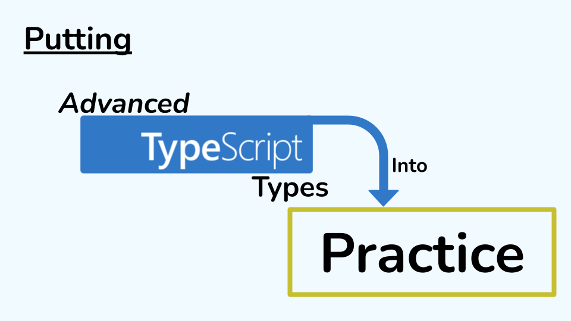

I was a speaker at [TypeScript Global Summit 2024](https://events.geekle.us/typescript24/).
My talk is about building complex TypeScript types in a way that they can be applied to practical problems.
This can be illustrated with grammY, my first large open-source project.
You can watch the recording [here](https://youtu.be/ZvT_xexjnMk).

**Edit 2024-07-18:** I have added subtitles to the video.
I still recommend watching the video, but if that is not your thing, you can read the following transcript.
Be sure to compare it to the [snapshots of the source code](https://github.com/KnorpelSenf/tsglobal24) while you're reading.

Here is the transcript:

---

Hi! My name is Steffen. As many of you guys, I very much enjoy building very complex types with TypeScript. The problem is that the more complex these types get, the more useless they get, too. So I was very excited when I found a use case where I could build very fancy and complicated types and have them actually be practical and relevant. So I would like to share this with you today. The idea of this talk is basically that we are going to do a lot of live coding and then we are going to build up this toolbox of useful tips and tricks that you can apply to your own project if you want to do fancy types and have them be useful.

Before we can actually build types, we have to write some code. This code has to solve a problem, so let's look at some problem. The most common problem (for backend at least) is probably building a web server. If you think about a web server, all it really does is handle HTTP requests. These HTTP requests have a certain structure applied to them already. So you have like a method like GET or POST and stuff, and then you have a path, and query parameters and hopefully also some headers. So this is pretty common, I guess.

What I've been doing in the past few years is to spend a lot of time with Telegram chat bots. A Telegram chat bot is also just a server that handles HTTP requests, but these requests don't really have much structure. They don't have a method. It's always POST so you can't get any info from that. And it's always the same path. There's no headers or anything, so everything you get really is contained in the JSON body of the request.

If you want to build a web framework for web servers, then typically, what people do is have this syntax that supports like POST and like the paths and all these things. But when you build a bot, that does not really work because that's not a useful abstraction so when I built my framework grammY which helps build Telegram chat bots, we used this syntax instead which basically lets you register handlers for certain types of events, called updates, that your bot receives from Telegram. This is where the type magic happens, too, so like this part of the handler is what I want to focus on today.

And so we have to take a little deeper look into what these updates actually are. The most common update is probably this. You just get like a message property and it has some text in it. So this just tells us “okay, there's like a new message from some user.” If the user edits this message, then you're going to get like an edited_message update and you can see “okay, this is the new text now.” Similarly, if the user sends a photo, you get like this photo message. So this is pretty clear, I guess. In grammY, you have like hundreds and hundreds of these event types that you can filter for. They're called filter queries and in your editor, it will look like this. So you can type “okay, give me text messages” and it's going to suggest you all the types of messages that you can listen for.

Alright, so now that we know roughly what we want to build, let's take a look at how we can do this in TypeScript. The first thing is to model the JSON objects that we get from the Telegram API which is easily done with a union type of message or edited_message and then we can get like message objects. And so what we want to end up with in the end is something like this. And now we can do something like bot.on('message'), and receive a context object here and then we wanna do like, whatever, something like this, right.

Let's create this bot class to make that code actually work. It will take a context object as a parameter. Now we can write our normal functions here to handle updates. I'm going to skip the implementation of these functions because we just want to talk about types for now and not the runtime code. Anyone can do that.

Okay, so, event types. You could think of them like event types in event emitters, but I'm going to stick with the grammY terminology of filter queries because in practice, they really aren't event types. But that code would like something like this.

Okay, so this code works now, except that TypeScript does not know that when we want to handle message updates, that the message property is actually present on the context object. So at this point, even though we handle message updates only, TypeScript still thinks that the update could be a message or an edited_message. So, that is sort of annoying. But TypeScript lets us fix this by introducing a type parameter. So we can just put the type parameter here and say “okay, now we want to use it for the filter query type.” So what this buys us is that we can get access to Q here. And instead of just doing a handler for the context object, we can now actually filter down the context object based on the query that we receive.

Only thing that's left to do is define the type Filter. It receives a context object and then some filter query. Now, all we have to do really is to say okay, if you filter down a context, then it's still the context, but also, we know that the update property has, like, more things attached to it than TypeScript knows. In particular, in this case, what we know about the update if, like, Q for example is "message", is that we can extract this union member from the update. So, TypeScript has this helper type, it's called Extract, and we just put the update in there and what we have to do is, we have to extract all those union members that have a message key, so in this case, I will build this record here. And what this basically, like, this record, what this will end up being is something like this (at least, if you use a message handler). So you can see, in bot.on, it will infer correctly that Q is "message" and it will pass it to the handler, and so "message" will be here, and "message" will be there, and then it will extract the right union member of the update. Now you can see, okay, message is actually present, so we can handle it. That's nice, but what doesn't work yet is auto-complete.

If we try to auto-complete here, it doesn't know which filter queries are possible because all we said is that it can be any string, so TypeScript has no information about this. What we need to do for this is to actually define a new type, we will call it FilterQuery, and we can just say, okay, so the naïve implementation of FilterQuery would be to say okay, this is just keyof Update. Actually, it's string & keyof Update because ... TypeScript things. But we will see that this type is never. It is never because keyof a union just means “give me all the keys that exist in every single union member.” But there are no keys that exist in every single union member. Like, this only has the key message and this only has the key edited_message. There's no overlap. Hence, the result is never. There is a way to work around this, even though the fact that this doesn't work out of the box sort of is a red flag already that our modelling maybe is not that great. But we can define this helper type KeyOfUnion and then ... I'm not going to explain how this thing works, we're going to throw it out soon anyway, but the main point you should take away from this is just that you can work around it, but it's nasty. So ... we can do extends unknown and then do string & keyof Update and never and now you can see that if we use this type instead, KeyOfUnion<Update>, that things will ... not work actu–? Oh. Oh, this is just wrong. Right. No– oh. Oh. Oh, okay. Sorry. Now it works! Awesome. Live coding. What could go wrong, right? Okay, so now we have this type FilterQuery and when we check this, we do actually get the correct suggestions. So, that's nice.

Now, what we've seen is that here, we still did not put FilterQuery. We just permit string. And you could get the idea, okay, let's make the type stricter and put FilterQuery here, too, because we know that our Filter only should work for filter queries. Because stricter types are better, right? I would argue: no, we should leave this string because at the point where we call bot.on, it already checks that this is a FilterQuery, so at this point it already knows that it's a FilterQuery. Passing this on here still makes it a FilterQuery, so checking it again against filter queries comes at a performance cost. TypeScript has to check the same thing again—something that we already know. When I implemented it with a tighter constraint in the beginning, it actually took 60 seconds for TypeScript to open up auto-complete in grammY. And you really don't want to wait 60 seconds. So widening this union type of string literals from FilterQuery to just string actually boosted the performance quite a bit.

That is already the first point that I would you to take away from this talk. It's that if you can widen types to avoid unions, then do it. Avoid unions. Unions are expensive and if you don't have to compute them, just don't.

Alright, so that's nice. Let's add another feature. Let's say I want to handle not just one type of event, but let's say, okay, I want to handle either a message or an edited message. This is very simple. We just have to say, okay, instead of just permitting a filter query, we also permit an array of filter queries. Simple as that. And now, in the function body, we can say, okay, what if ctx.update.message is present, then we can do one thing, and otherwise, we can do something else, whatever. And now, you will see this won't work because ctx.update is never. And, why is that?

Well, bot.on infers Q as "message" | "edited_message". So it basically builds up a union type of all the elements in the array. So that means that there's gonna be a union type here of "message" | "edited_message". So we will pass "message" | "edited_message" to Filter. So we will get "message" | "edited_message" here. So it will build a record of "message" | "edited_message" which will look like this. The problem with this is that Extract will check all the different types, the union members of Update, against this object, and none of the members of this union type actually have both keys present. So what we want to have instead is something like this, right? That's actually what we meant. But TypeScript doesn't do this. And now, the only way to fix this is to use something called a distributed union type.

A distributed union type is not really something that is like extra syntax. It's more like a different way how TypeScript evaluates conditional types. So let's take a look at what this means. If you have like a regular type like some record of whatever, and you pass a union of string literals such as "a" | "b", then TypeScript will basically pass on this union to the record and you will get a record of a union type. So a record of two keys. So "a": string or "b": string. That's the normal TypeScript thing, and no distribution going on there.

So, distributed union types, they look a bit different. They have this conditional type where you just extend unknown, and everything extends unknown, so it looks kind of useless at first sight. But if you pass a union to this distributed union type now, what happens is actually that TypeScript will compute the record for each member of the union individually. So you will instead get a union of records, rather than a record of a union. So this union of records will then translate to a union of two different objects, one with "a" to string and one with "b" to string. So in a way, this T extends unknown condition distributes the unions of the type parameter to two different unions. That's why they're called distributed union types. This is something that isn't apparent in the syntax, but it's very fundamental to how union types work. And so, this is the second learning today. You have to think about union distribution. It's very useful to have this feature, and at the same time it can be really painful if you don't know about it. So, now we do know, so that's nice.

Let's continue. For example, we've seen here that the distributed union type works becau– well, okay, no, we have to implement it first. Okay. We can do this implementation by saying, okay, we've learned that we can just do Q extends unknown, and then do one condition here and one condition there, and now, ctx.update is no longer never, but it's actually a union type of both possibilities. Turns out, it still doesn't really work, but this is not so much about union types. It's just because if ctx.update has edited_message, then message is not present, so we can't actually access .message. So we have to do this ugly workaround, which is another, a second ugly workaround which is another red flag that maybe our modelling is not a great as it could be. But at this point it works. Now, we can just access ctx.update.message and it just turns out to work.

We did that for a while in grammY, but the problem with this is that it took like 7 GB of memory to compile the library and compilation would take 45 minutes. And you really don't have that much time to wait 45 minutes every single time you want to compile. And so not only do we have this ugly workaround and the other ugly workaround up here, we also have very slow compilation times. And so, it really became a big problem when we saw errors like this appear. And TypeScript already tells us that there are no quick fixes available. So we have to completely reconsider how to model this API.

Because union types are bad. Not generally, but like, at scale. Because what happens in this Extract? If you use Extract, and you have this message: object mapping, it will check assignability to the first member of the update union, and then it will check assignability to the second update union, and then it will check assignability to all the other parts of Update that I did not mention in this talk. And even worse, if we not listen for one update but like for "message" | "edited_message", we get like this union of records and we have to check assignability between both things to message. And then we have to check assignability of both things to edited_message and so on and so forth.

So we build up this huge quadratic table of assignability checks and, you know, if there are like more than a thousand filter queries in grammY and you can use several, like, maybe a dozen or so in the event handling, and there are, I don't know, hundreds of types of messages, it makes a lot of sense why TypeScript gets so slow. It's just an immense amount of computation that TypeScript has to perfom.

So let's just throw out unions entirely. And instead of using a union here, we're just going to inline everything and say, okay, we just make it a good old interface with optional keys. And here as well. And make them optional again. Nice.

Now, obviously, well, okay, the first thing we notice is that we no longer need the KeyOfUnion helper type. We can literally just say, okay, we wanna have a regular keyof Update and everything works as it should. And the next thing is that instead of having to do some weird extract logic, we can just say, okay, let's throw this away entirely, and say okay, we have still a context object and we still know something else about the update. And all we really want to assert is that there's a record of some FilterQuery type and it maps to object and this is known to be present. So, this is already everything you need to work with our new abstraction.

And it will work here and there and it also works down here and we can even through away our weird workaround around the types and instead use regular idiomatic JavaScript and it all works out.

So the downside of not using a union type is that if you look at ctx.update, it will still suggest you to use edited_message, even though we know we're in a message handler. But it will know that edited_message is potentially absent. So that means that we can't really get any runtime errors because whenever we would use this, it would force us to check for presence. But technically, the types are a little less accurate than before. And my point is that that's fine.

We should balance type performance and type accuracy. You don't have to go crazy on accuracy if it impacts performance that negatively. So it's not an end in itself to make your types as accurate as possible. You just have to make them usable and practical and there's still very fancy stuff you can do without hurting performance too much and hurting usability too much.

Alright. Let's add yet another feature. We can see that we always have to access ctx.update and that is rather annoying. Instead, I would just like to do ctx.message. That's pretty simple to implement. We just go to the Context type, define a getter, and say, okay, ctx.message just always returns this.update.message. Same thing for editedMessage. Easy.

Notice how in the modelling of our JSON updates, we had to use like the snake case naming, but now that we are in JavaScript land, we can use idiomatic JavaScript names of camel casing. We can immediately see that even though we're still in a message handler, TypeScript does not understand our implementation. It still thinks that ctx.message is potentially absent, even though it really can't be.

So we have to explicitly tell TypeScript, okay, we can intersect another record here, and be like, okay, not only is the update type (the property) narrowed down, but also the getter itself. This works, so that's cool, but you notice that when you look at edited_message updates, then it will actually suggest ctx.edited_message and think that this is present. That is obviously wrong. The problem is that in our record, we just passed on the FilterQuery type directly to Record, so now it asserts this underscore naming, even though our getter really has the camel case naming and so this is just all wrong.

And you could give up and say, okay, this is impossible to type, but we are in TypeScript land and we can do anything, so let's just define a type that translates our snake to camel case. That is rather simple actually. Surprisingly simple. It just takes any string and checks if this string has an underscore in it. It it does, then we infer the left side of the string and then we also infer the right side of the string. If it does not have this underscore, we just return the string itself, but if it does, then we can construct a new string and say, okay, we take the left side again, and no underscore, and then we put the capitalised version of the right side here. That's it.

Now we can test this and say, okay, let's say type X, whatever, is SnakeToCamelCase of 'foo'. Very simple. Nice, that works correctly. Let's say we want to use 'foo_bar'. Nice, that also works correctly. Let's try 'foo_bar_baz'. And here you can see that it only actually substitutes the first underscore and not the rest, so we've seen that it does not recursively apply this logic to itself, so all we have to do really is to say, okay, we just add another SnakeToCamelCase definition inside here and now things work.

What you've seen just now is that I defined three completely useless helper types with very concrete values that help me make sense of this rather weird-looking magic. It's not a lot of code, but it is, like, you have to think about it for a second to understand it. And that is a very effective strategy to understand how types work and to develop them, too. So that's the fourth learning for today, is like, inspecting intermediate types. That is, like, so useful. Instead of, like, looking at a huge complex type and being overwhelmed, actually just strip it down, try to put very concrete values into it and test with type inference and hovering how these things work. That is a very effective strategy to make sense of all this magic that you write.

So that's what we used in grammY and now we can actually see that our type works, too. We can apply SnakeToCamelCase here around our record (the keys) and it will tell us, okay, edited_message is absent. This doesn't exist. And it even says, hey, “Did you mean editedMessage?” We did. It should be this.

This has worked for quite a while actually very well. The logic in grammY is a lot more complicated but basically, it's this. In the past three years, we've added more and more filter queries to grammY and we've crossed—just last month actually!—the threshold of more than a thousand of them. We just recently ran into an issue where we'd get like another case of union types that are too complex to represent and just stuff that is very hard to understand.

You can't always make sense of these things. If your library develops in complexity and everything grows and becomes more feature-rich, then the most effective strategy to find out why things break and how they work is to try it and see. This practical, iterative approach—just, you know, dive it and analyse why things work the way they work—that is basically the best advice I can give to anyone who wants to build complex types.

All of the above four things are things that I only found out because I tested and tried. Even though types sometimes can feel like some academic wizardry or, I don't know, you have to be some genius to write them, that is not actually the case. They are quite similar to how runtime code is written or like, I don't know, how you do performance benchmarking. You have to just test it and measure it and see and try and narrow down the problems.

If you only take one thing away from my talk, then it should be that you should balance type performance and type accuracy. I know it's a lot of fun to go crazy on accuracy, but it comes at a cost. It comes at the cost of performance, it comes at the cost of understandability, and it's important to have this in mind that accuracy is not everything, even though it can be a lot of fun.

With that, I thank you very much for your attention. This is how you can reach me if you have further questions. I also put snapshots of what I just coded on GitHub so you can have a look at the repository. Otherwise, I will hand it back to Sia.
